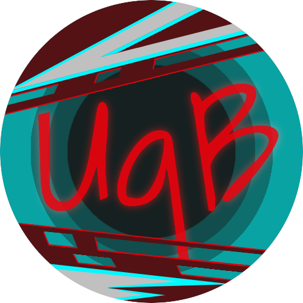

        

        <b><h2>UbiquiBot</h2></b>
        <a href="https://github.com/AxonneQ/UbiquiBot/wiki">Documentation</a> |
        <a href="#invite">Invite to your server</a> |
        <a href="https://github.com/AxonneQ/UbiquiBot/wiki/Command-List">Command List</a>

 

 

UbiquiBot is an open source multi-purpose discord bot.

Main features include:

* Random Jokes
* Server Statistics
* Experience System for Members

Planned Features:

* Music features
* Song Lyrics search
* Hangman game
* Blackjack
* Points system
* Reaction Based Role Assignment
* Voting System

... and more!

### 
 Invite UbiquiBot to your server! 

You can see which permissions are needed [here](https://github.com/AxonneQ/UbiquiBot/wiki/Required-Permissions).

